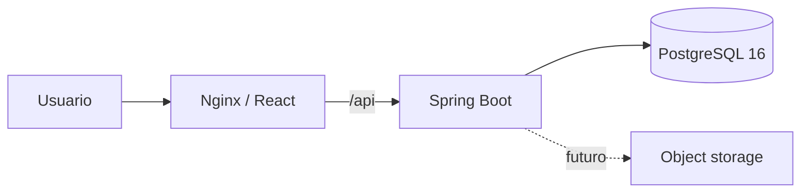
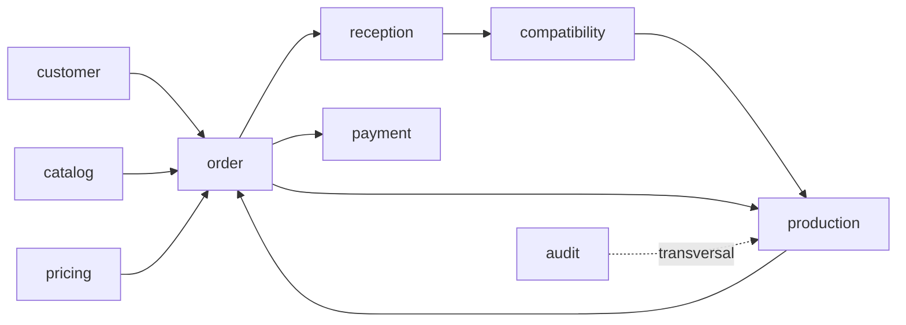

# Arquitectura

Versión funcional: `0.4.0`.

## Vista general

Monolito modular Spring Boot, SPA React y PostgreSQL. Se priorizan transacciones consistentes, snapshots históricos y operación simple.



## Módulos backend

```text
auth            identidad, JWT, refresh y roles
audit           eventos sensibles
catalog         servicios y equivalencias
customer        clientes y domicilios
location        zonas
pricing         precios y promociones
order           pedido declarado y estados
payment         cobros
reception       snapshot físico y diferencias
compatibility   perfiles, motor y excepciones
production      máquinas, programas, ciclos y calidad
common/config   contratos e infraestructura transversal
```

Capas: `api → application → domain/persistence`.

`CatalogController` conserva una excepción histórica de acceso directo a repositorios; no replicarla.

## Dependencias principales



## Flujo de ciclo

```text
POST /production/cycles + Idempotency-Key
→ ProductionController.createCycle
→ ProductionService.createCycle
→ advisory lock por clave
→ bloqueo de máquina/programa/pedidos
→ validación de etapa, perfil, programa y capacidad
→ evaluación vigente si hay dos pedidos
→ ProductionCycle + asignaciones + historial
→ actualización WAITING_WASH cuando corresponde
→ auditoría
```

Inicio/completado bloquean ciclo, máquina y pedidos. Las transiciones de pedido siempre pasan por `OrderTransitionPolicy`.

## Persistencia

- PostgreSQL 16;
- Flyway `V1`–`V10`;
- `ddl-auto=validate`;
- UUID internos y números legibles separados;
- gramos enteros;
- dinero `NUMERIC`;
- eventos `TIMESTAMPTZ`;
- JSONB para snapshots explicables;
- constraints únicos/parciales como última defensa.

`V9` agrega producción. `V10` impide alterar parámetros técnicos de programas usados. Migraciones futuras: `V11+`.

## Concurrencia

- promoción al confirmar precio;
- pedido al pagar/recibir/guardar perfil;
- dos pedidos en orden UUID al evaluar;
- evaluación al exceptuar;
- advisory lock por `Idempotency-Key` de ciclo;
- máquina, programa, pedidos y ciclo con bloqueo pesimista;
- índice parcial impide dos ciclos activos por máquina;
- clave idempotente global única.

## Modelo histórico

- pedido declarado no se sobrescribe con recepción;
- recepción no se recalcula con catálogo futuro;
- evaluación conserva versiones y `COMPAT-1`;
- excepción se guarda separada;
- ciclo conserva programa referenciado e historial;
- parámetros técnicos de programa usado quedan protegidos.

Limitación: la capacidad de la máquina es configuración mutable fuera de ciclos activos; el ciclo conserva pesos planificado/real, no un snapshot completo de la máquina.

## Frontend

`App.tsx` define rutas protegidas. `ProductionPage.tsx` consulta máquinas/programas/ciclos y ejecuta el flujo base. `httpClient.ts` conserva access token en memoria, envía cookies y renueva una sola vez en vuelo.

## Infraestructura local

```text
frontend:Nginx → backend:8080 → postgres:5432
```

Los puertos host son configurables y se publican en loopback. Nginx resuelve `backend` de forma diferida.

## Límites

Sin event bus, object storage, rutas, caja/costos completos, optimizador de producción, tracking físico de separación, observabilidad central, backup automatizado ni despliegue productivo.
