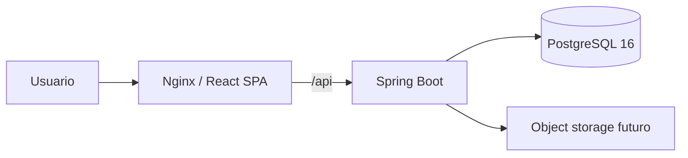
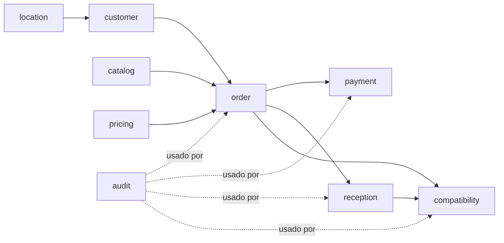

# Arquitectura

Versión funcional: `0.3.0`.

Referencia: `origin/main` en `6f6d3cd8256408bc574e5b3d4568bf1b2866b0d8`.

## Vista general

El sistema es un monolito modular con una SPA separada y PostgreSQL. Se prioriza consistencia transaccional, historial explicable y operación simple antes que distribución.



`O` no está implementado; la base solo conserva metadata.

## Módulos backend

```text
auth           identidad, sesiones, roles y throttling
audit          eventos sensibles y consulta
catalog        servicios y equivalencias
customer       clientes, preferencias y domicilios
location       zonas
pricing        precios, promociones y usos
order          pedido declarado, estados y planificación
payment        cobros e historial
reception      snapshot físico, diferencias y decisión
compatibility  perfiles, motor, evaluaciones y excepciones
common         contratos API, errores y entidad auditable
config         configuración transversal
```

Dependencias de negocio principales:



## Capas y límites

Cada módulo usa las capas necesarias:

```text
api → application → domain/persistence
```

- API: HTTP y DTO.
- Aplicación: orquestación, transacciones, bloqueos y auditoría.
- Dominio: entidades y reglas locales.
- Persistencia: repositorios JPA.
- Infraestructura: adaptadores técnicos.

Regla: controladores no deben acceder directamente a repositorios ni decidir reglas.

Excepción verificada: `CatalogController` inyecta dos repositorios. Es deuda técnica registrada en [`KNOWN_ISSUES.md`](KNOWN_ISSUES.md); no debe replicarse.

## Flujos críticos

### Autenticación

```text
POST /auth/login
→ AuthController.login
→ AuthService.login
→ LoginAttemptService + UserAccountRepository
→ JwtService + RefreshTokenRepository
→ access token en respuesta + refresh cookie
```

El access token solo vive en memoria del frontend. El refresh se persiste hasheado, rota y puede revocarse.

### Alta y cotización de pedido

```text
POST /orders
→ OrderController.create
→ OrderService.create
→ cliente/domicilio + catálogo + PricingService
→ LaundryOrder + OrderItem + historial
→ PostgreSQL
→ OrderResponse
```

Piezas físicas, grupos y unidades equivalentes son magnitudes distintas. Precio y desglose aplicados quedan históricos.

### Confirmación de precio

```text
POST /orders/{id}/confirm-price
→ OrderService.confirmPrice
→ bloqueo de promoción
→ revalidación de vigencia/cupo
→ PromotionUsage + precio confirmado
→ auditoría
```

### Pago

```text
POST /payments
→ PaymentController.register
→ PaymentService.register
→ bloqueo de LaundryOrder
→ recálculo de saldo y prevención de sobrepago
→ Payment + estado de pago
→ auditoría
```

### Recepción

```text
POST /orders/{id}/reception + Idempotency-Key
→ ReceptionController.receive
→ ReceptionService.receive
→ búsqueda temprana por clave
→ bloqueo de LaundryOrder
→ validación de estado/composición
→ ReceptionDifferencePolicy
→ OrderReception + ReceptionItem + metadata
→ transiciones RECEIVED/PENDING_INSPECTION/CLASSIFIED o WAITING_PRICE_APPROVAL
→ auditoría
```

La recepción real no sobrescribe `OrderItem`.

### Decisión de recepción

```text
POST /orders/{id}/reception/decision
→ ReceptionService.decide
→ bloqueo de pedido
→ valida recepción PENDING
→ APPROVED → CLASSIFIED
  o REJECTED → CANCELLED
→ auditoría
```

### Perfil efectivo

```text
PUT /orders/{id}/compatibility-profile
→ CompatibilityService.saveProfile
→ bloqueo de pedido
→ exige CLASSIFIED + recepción
→ combina request + preferencias + exclusividad
→ OrderTreatmentProfile versionado
→ auditoría
```

La combinación es monotónica: no relaja prohibiciones.

### Evaluación

```text
POST /compatibility/evaluate
→ CompatibilityService.evaluate
→ normaliza UUID
→ bloquea ambos pedidos en orden canónico
→ relee perfiles/versiones
→ busca snapshot por par/versiones/COMPAT-1
→ CompatibilityEngine.evaluate si falta
→ persiste razones/recomendación JSONB
→ auditoría
```

`CompatibilityEngine` es puro y determinista.

### Excepción

```text
POST /compatibility/evaluations/{id}/exception
→ bloqueo de evaluación
→ exige resultado original incompatible y ausencia de excepción
→ CompatibilityException
→ conserva compatible/reasons/recommendation
→ auditoría
```

## Persistencia

- PostgreSQL 16.
- Flyway `V1`–`V8` como autoridad.
- Hibernate `ddl-auto=validate`.
- UUID internos.
- `NUMERIC(15,2)`/`BigDecimal` para dinero.
- gramos enteros.
- `TIMESTAMPTZ` para eventos.
- JSONB para snapshots explicables.
- constraints únicos como última defensa.

Migraciones publicadas no se editan.

## Concurrencia

Bloqueos pesimistas confirmados:

- promoción al confirmar precio;
- pedido al pagar;
- pedido al recibir;
- pedido al guardar perfil;
- dos pedidos en orden UUID al evaluar;
- evaluación al exceptuar.

Los constraints no reemplazan el orden transaccional.

## Frontend

```text
main.tsx
→ BrowserRouter
→ AuthProvider
→ App
→ ProtectedRoute / AppShell / páginas
```

`httpClient.ts`:

- usa `VITE_API_BASE_URL`;
- conserva access token en variable de módulo;
- envía cookies;
- agrupa una sola renovación en vuelo;
- reintenta una vez tras `401`;
- convierte el contrato de error en `ApiClientError`.

La UI previsualiza, pero backend decide permisos, límites, estados, precio y compatibilidad.

## Despliegue local

Compose ejecuta:

```text
frontend:Nginx → backend:8080 → postgres:5432
```

Los puertos host son configurables y se publican en `127.0.0.1`. Nginx resuelve `backend` de forma diferida. Healthchecks y scripts controlan arranque parcial.

No es arquitectura productiva.

## Trade-offs confirmados

- Monolito modular: transacciones simples y menos operación; menor autonomía de despliegue.
- Bloqueo pesimista: adecuado al volumen inicial; puede limitar concurrencia futura.
- JSONB para resultados: preserva explicación; dificulta consulta tipada.
- Reglas en código: determinismo y versionado explícito; sin edición administrativa.
- Metadata de evidencias: evita binarios en PostgreSQL; requiere storage externo consistente.
- SPA + API: separación de UI; exige mantener contratos TypeScript sincronizados.

## Límites actuales

No hay event bus, caché distribuida, object storage, motor administrable, ciclos, máquinas, rutas, caja, backup automatizado ni observabilidad central.
