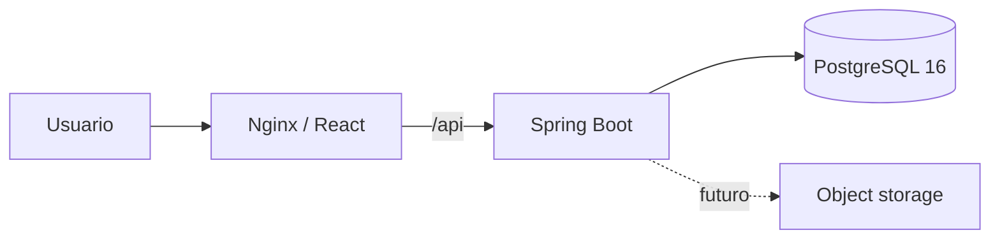

# Arquitectura

Versión funcional: `0.4.4`.

## Vista general

Monolito modular Spring Boot, SPA React y PostgreSQL. Se priorizan transacciones, snapshots históricos y operación simple.



## Módulos backend

```text
auth            identidad y sesiones
audit           eventos sensibles
catalog         servicios/equivalencias y consultas vigentes
customer        clientes/domicilios
pricing         precios/promociones
order           pedido y estados
payment         cobros
reception       snapshot físico
compatibility   perfiles/evaluaciones
production      máquinas, programas, ciclos, separación, métricas y calidad
common/config   contratos e infraestructura
```

Capas: `api → application → domain/persistence`. Desde 0.4.3, `CatalogController` delega en `CatalogQueryService`; no quedan accesos directos conocidos desde controladores a repositorios.

## Catálogo

```text
GET /catalog/services|equivalences
→ CatalogController
→ CatalogQueryService
→ repositorios de catálogo
→ vistas inmutables
```

La deduplicación por código conserva la primera versión aplicable en el orden entregado por persistencia.

## Ciclos y separación

```text
POST /production/cycles + Idempotency-Key
→ advisory lock
→ bloqueo de máquina/programa/pedidos
→ validación de etapa, perfil, capacidad y compatibilidad
→ ciclo/asignaciones
→ si existe excepción: separationRequired
→ confirmación de contenedores bajo bloqueo del ciclo
→ ProductionCycle.start exige todas las confirmaciones
```

## Métricas

```text
GET /production/metrics?from&to
→ ProductionMetricsController
→ ProductionMetricsService
→ validación de rango
→ agregado SQL sobre production_cycles / programs / assignments
→ DTO inmutable
```

El agregado usa `created_at` en `[from,to)`, máximo 366 días. Peso real y duración provienen solo de ciclos completados. No usa capacidad actual de máquina ni infiere costos.

## Persistencia

- Flyway `V1`–`V11`, `ddl-auto=validate`;
- `V9`: producción;
- `V10`: inmutabilidad de programas usados;
- `V11`: contenedores/confirmaciones;
- 0.4.2, 0.4.3 y 0.4.4 no agregan migraciones.

## Concurrencia

Bloqueos pesimistas en promociones, pedidos, evaluaciones, máquina, programa y ciclo; advisory lock por clave; orden UUID canónico; índices únicos/parciales como última defensa.

## Modelo histórico

Pedido, recepción, evaluación y ciclo no se sobrescriben. La capacidad de máquina sigue siendo mutable fuera de ciclos activos; por ello 0.4.2 no publica utilización histórica.

## Frontend

`ProductionPage`, `ProductionSeparationPage`, `ProductionMetricsPage` y `ProductionConfigurationPage` consumen contratos backend. El access token permanece en memoria.

## Límites

Sin object storage, rutas, caja/costos, optimizador, snapshot histórico de capacidad, observabilidad central, backup automatizado ni despliegue productivo.
